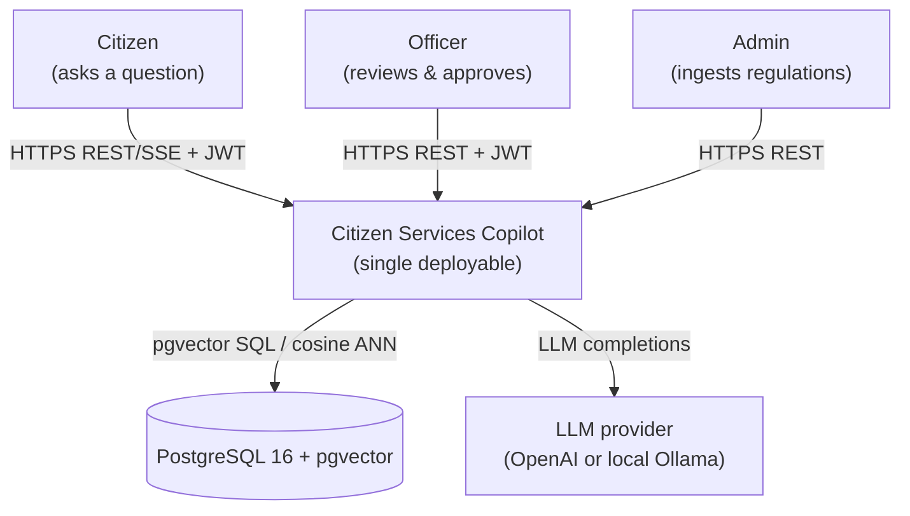
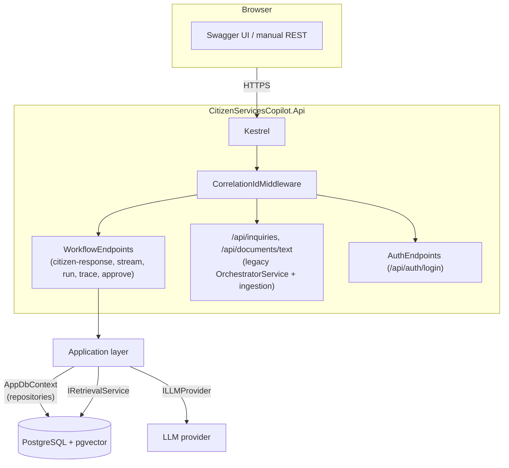
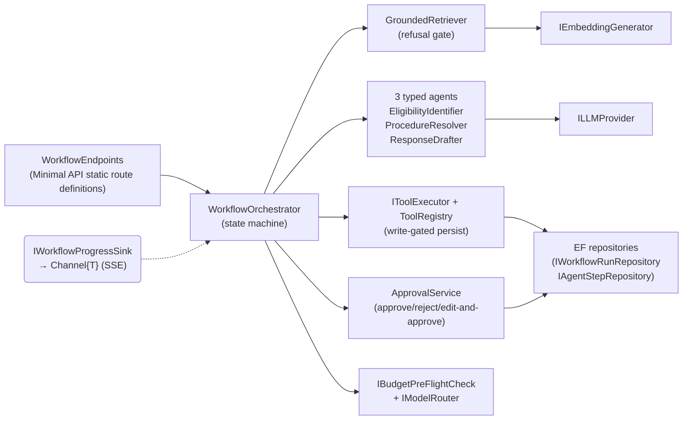
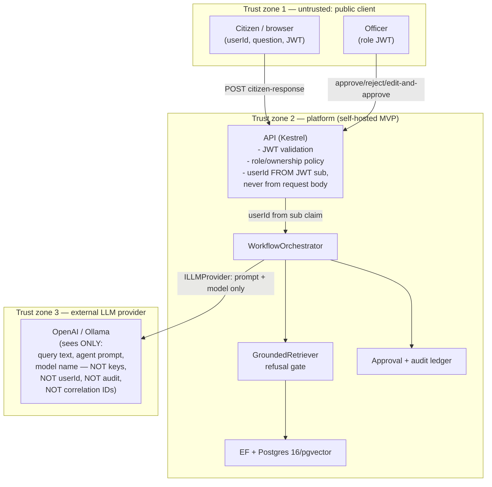
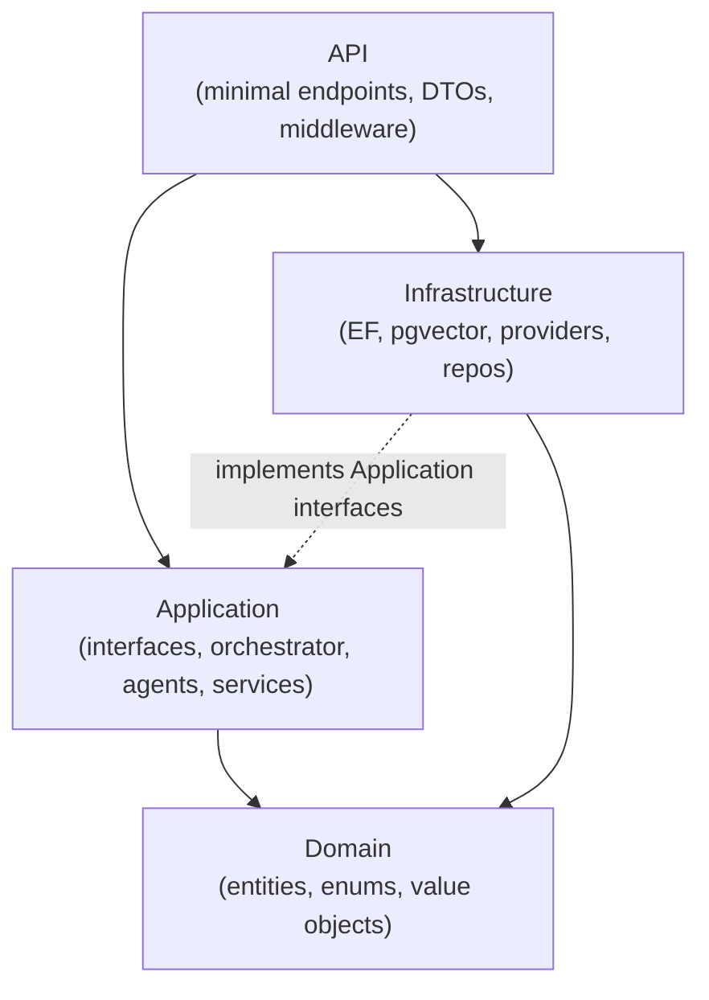

# Architecture — Citizen Services Copilot

Clean Architecture (API → Application → Domain; Infrastructure owned by
Application). C4 diagrams below are committed as Mermaid sources.

## C4 L1 — Context



## C4 L2 — Containers



## C4 L3 — Components (workflow path)



## Sequence — Full agentic workflow incl. approval gate + streaming

Mermaid source (committed; rendered by any Mermaid renderer, e.g. GitHub).

```mermaid
sequenceDiagram
    participant C as Citizen (browser)
    participant API as API (RunAsync path)<br/>WorkflowEndpoints
    participant OR as WorkflowOrchestrator
    participant RET as GroundedRetriever
    participant AG as Agents (3x)
    participant LM as LLM provider
    participant DB as Postgres/pgvector
    participant O as Officer
    participant AV as ApprovalService
    participant DB2 as Audit/Approval rows

    C->>API: POST /api/workflows/citizen-response {question} + JWT
    API->>API: resolve userId from JWT sub; persist runId
    API-->>C: 202 Accepted {runId}
    Note over API,OR: background task in dedicated DI scope (a04eaa4)
    API->>OR: RunAsync(userId, question, model, runId)
    OR->>RET: RetrieveAsync(query)
    RET->>DB: vector cosine search (HNSW)
    RET-->>OR: RetrievalResult (or Refusal)
    alt insufficient evidence
        OR-->>API: run → Failed (refused)
    else evidence present
        OR->>AG: run EligibilityIdentifier
        AG->>LM: completion(prompt, model)
        LM-->>AG: output
        OR->>AG: run ProcedureResolver
        AG->>LM: completion(...)
        LM-->>AG: output
        OR->>AG: run ResponseDrafter (JSON draft)
        OR->>AV: stage AwaitApproval
        OR-->>API: run → WaitingApproval
    end
    O->>AV: POST /api/runs/{id}/approve (+ officer JWT)
    AV->>DB2: write ApprovalAudit (approverId from JWT sub)
    AV-->>O: 200 {decision: Approved, approverId}
    O->>AV: (optional) edit-and-approve
    AV-->>OR: proceed → persist draft
    OR->>DB: PersistDraft tool (write-gated)
    OR-->>API: run → Completed
    Note over C,API: streaming variant
    C->>API: GET /api/workflows/stream?question=... (SSE)
    API->>OR: RunAsync(..., progress: Channel sink)
    OR-->>API: stage/step/done events
    API-->>C: SSE data: {stage|step|done} events
```

## Data-Flow Diagram with Trust Boundaries



**What the LLM provider sees — boundary note:**
The provider receives only (a) the agent prompt built from the corpus query
and retrieved chunks, and (b) the resolved model name. It never receives the
user's JWT, the `userId` (`sub`), correlation ids, API keys, the budget ledger,
or the approval audit trail. Grep evidence: `ILLMProvider.GenerateCompletionAsync(LlmPrompt, ...)` —
the prompt carries no identity claims; identity is resolved server-side from
`http.User` (`GetUserId`/`IsOfficer` in `WorkflowEndpoints.cs`).

## ER Diagram

```mermaid
erDiagram
    Document ||--o{ DocumentChunk : "has chunks"
    Document {
        guid Id PK
        string Title
        string Source
        string ContentHash "SHA-256"
        string Status "Completed|Failed"
    }
    DocumentChunk {
        guid Id PK
        float[] Embedding "vector(1536)"
        int PageNumber
        string Section
        string Content
    }
    UserBudget {
        string UserId PK
        decimal AllocatedBudgetUsd
        decimal SpentUsd
        int TotalTokensUsed
        bool IsBlocked
    }
    WorkflowRun ||--o{ AgentStep : "records steps"
    WorkflowRun ||--o{ ApprovalAudit : "is decided by"
    WorkflowRun ||--o| PersistedDraft : "ultimately writes"
    WorkflowRun {
        guid Id PK
        string UserId FK "runs owned by user"
        string Status "NotStarted..Cancelled"
        Guid? CorrelationId
        decimal TotalCostUsd
        string? ErrorMessage
    }
    AgentStep {
        guid Id PK
        guid RunId FK
        int Order
        string Role
        string Status
        int? TokensIn
        int? TokensOut
        decimal CostUsd
        int DurationMs
        string? OutputSummary
    }
    ApprovalAudit {
        guid Id PK
        guid RunId FK
        string ApproverId
        string Decision "Approved|Rejected"
        string? Reason
        string? ModifiedDraftJson
    }
    PersistedDraft {
        guid Id PK
        guid RunId FK
        string DraftJson
    }
    Inquiry ||--o{ InquiryDraft : "drafts"
    Inquiry {
        guid Id PK
        string UserId
        string Status "Drafted|Refused"
    }
```

## Layer Dependency Diagram



Invariant (CI-enforced by `dotnet format` only — dependency *direction* is
reviewed manually per PR): `Application` references **no** persistence or
provider SDKs; the only NuGet dependency is
`Microsoft.Extensions.DependencyInjection.Abstractions`.

## ADR Index (ADR-001 .. ADR-006)

| ADR | Title | Status | File / Evidence |
|---|---|---|---|
| ADR-001 | Use PostgreSQL + pgvector for vector storage | Accepted | `docs/adr/0001-use-postgresql-pgvector-for-vector-store.md` (commit `9d79bb3`) |
| ADR-002 | **Deferred write-up**: JWT bearer + role policies | Decision recorded | Implicit in commit `910a962` (feat: JWT auth + role-based authorization); recommended ADR 00x extraction |
| ADR-003 | **Deferred write-up**: SSE streaming over WebSockets | Decision recorded | Implicit in commit `84aa16e` (SSE + client cancellation) |
| ADR-004 | **Deferred write-up**: cost governor (pre-flight + hard cutoff + tiered routing) | Decision recorded | Implicit in commits `58ebea2`, `926459a`, `724fb9b` |
| ADR-005 | Orchestration pattern — state machine | Accepted | `docs/adr/0005-orchestration-pattern.md` (commit `af08522`) |
| ADR-006 | **Deferred write-up**: background execution via dedicated DI scope | Decision recorded | Implicit in commit `a04eaa4` (root-anchored scope; durable-queue alternative in Part B) |

## Endpoint → Source Map

| Endpoint | File |
|---|---|
| `POST /api/inquiries`, `POST /api/documents/text`, `/health`, `/ready` | `src/CitizenServicesCopilot.Api/Program.cs` |
| `POST /api/workflows/citizen-response`, `GET /api/workflows/stream`, runs/trace/spend/approve/reject/edit-and-approve | `src/CitizenServicesCopilot.Api/Endpoints/WorkflowEndpoints.cs` |
| `POST /api/auth/login` | `src/CitizenServicesCopilot.Api/Endpoints/AuthEndpoints.cs` |
| Correlation middleware | `src/CitizenServicesCopilot.Api/Middleware/CorrelationIdMiddleware.cs` |